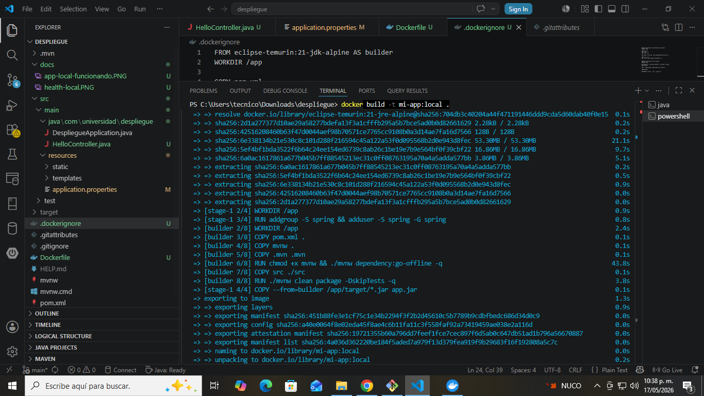
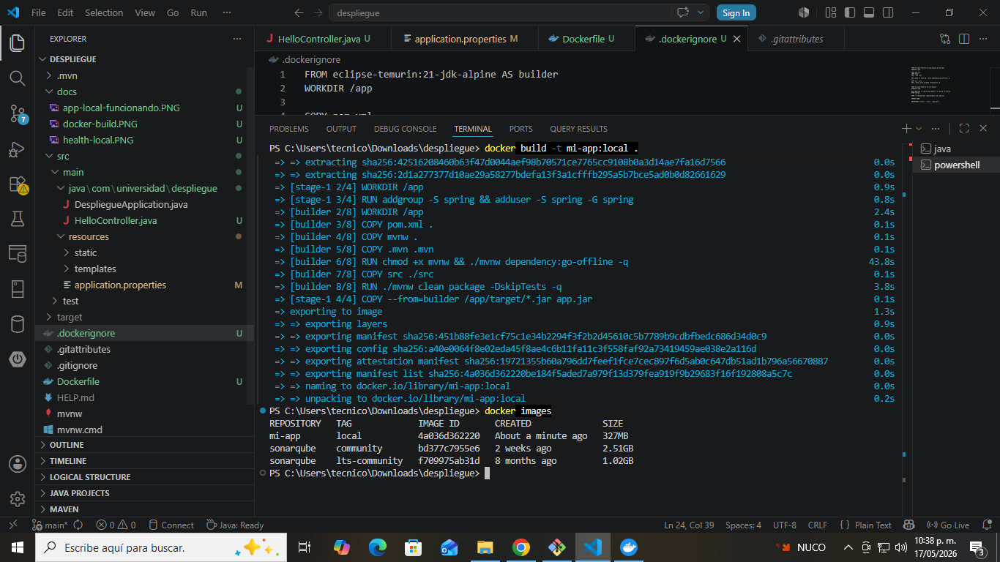
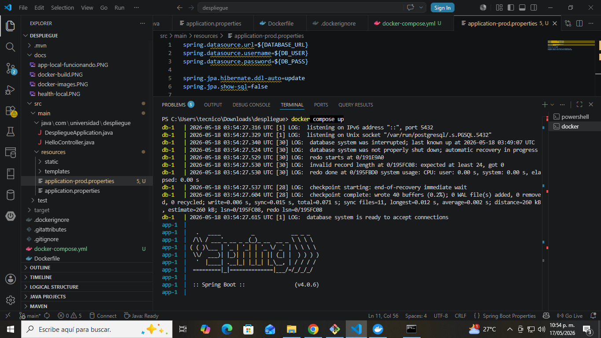
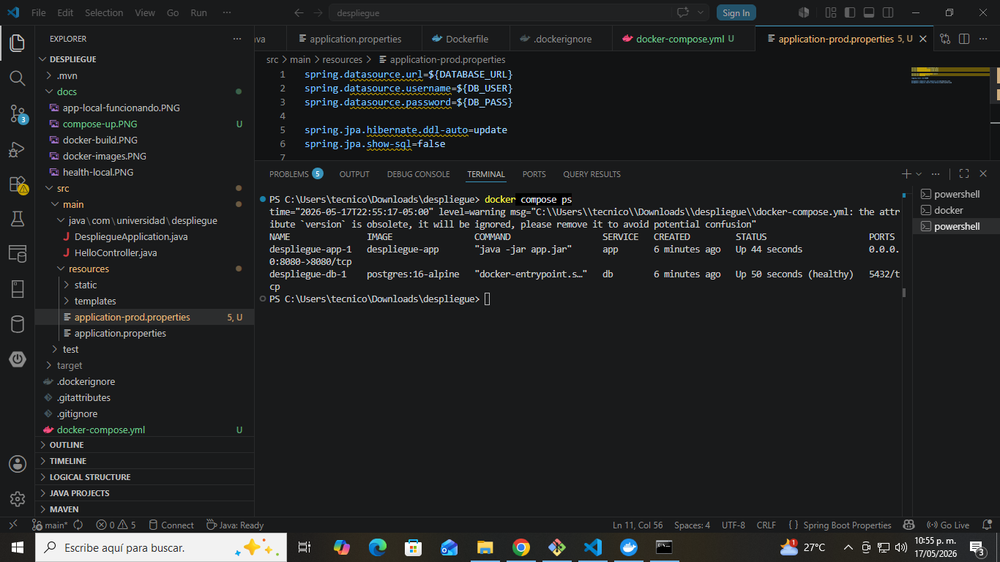
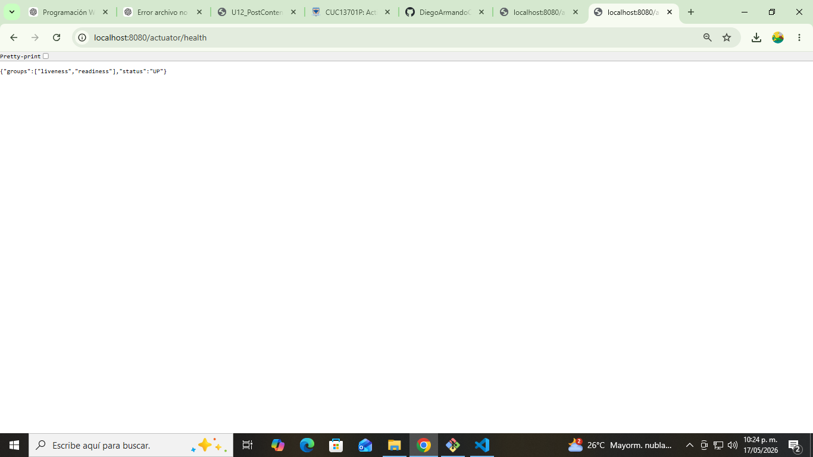
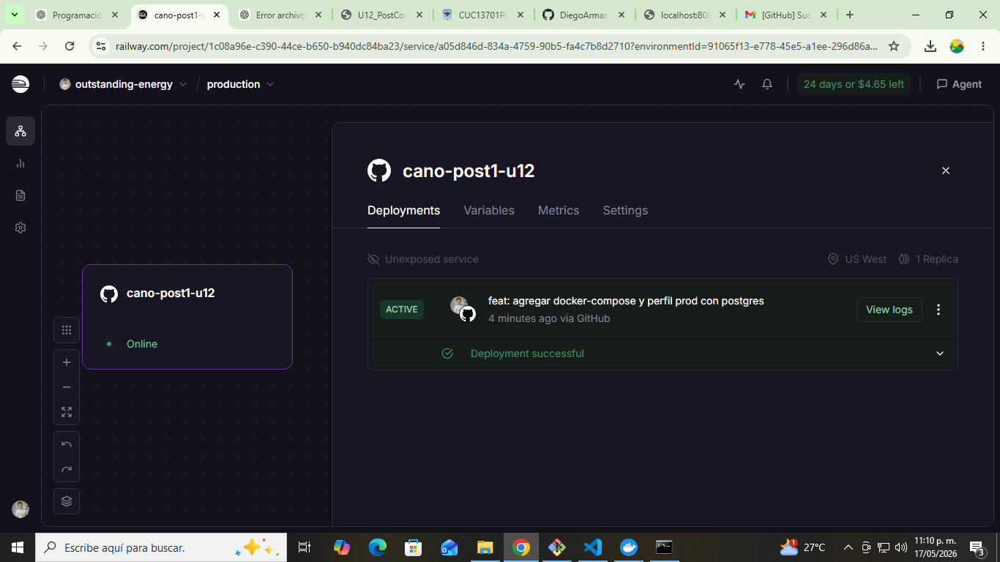
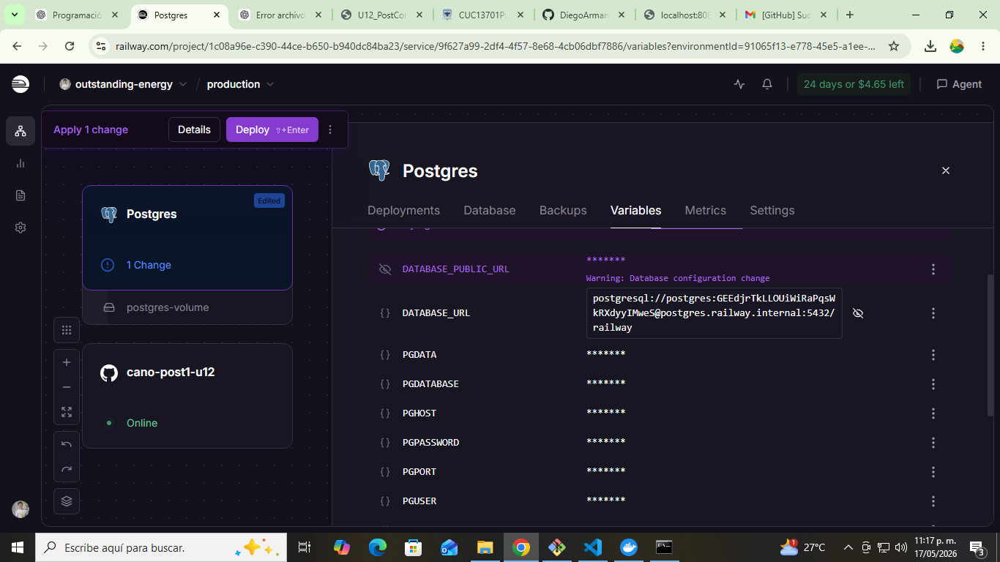

# 🚀 Cano Post 1 - U12 | Spring Boot + Docker + Railway

Proyecto de despliegue de una aplicación Spring Boot utilizando Docker multi-stage, Docker Compose con PostgreSQL y despliegue en Railway con variables de entorno.

---

## 👨‍💻 Autor
Diego Armando Cayetano  
Ingeniería de Sistemas - 2026

---

## 📌 Tecnologías utilizadas

- Java 21 (Spring Boot)
- Maven
- Docker (multi-stage build)
- Docker Compose
- PostgreSQL 16
- Railway (deploy cloud)

---

## 📁 Estructura del proyecto


cano-post1-u12/
├── src/
├── docs/ ← capturas del laboratorio
├── Dockerfile
├── docker-compose.yml
├── .dockerignore
├── pom.xml
└── README.md


---

# 🐳 Parte 1: Dockerfile Multi-Stage

Se implementó un Dockerfile con dos etapas:

- Builder (compilación con Maven + JDK)
- Runtime (solo JRE optimizado)

### 📦 Evidencia de build


### 📦 Imágenes generadas


---

# 🧹 .dockerignore

Se excluyen archivos innecesarios para optimizar el build:

- target/
- .git/
- .idea/

---

# ⚙️ Parte 2: Docker Compose + PostgreSQL

Se configuró un entorno local con:

- Aplicación Spring Boot
- Base de datos PostgreSQL
- Variables de entorno para producción

### 🐘 Servicios levantados


### 📊 Estado de contenedores


---

# 🧪 Pruebas locales

### ✔ Health check
http://localhost:8080/actuator/health



### ✔ App funcionando localmente


---

# ☁️ Parte 3: Despliegue en Railway

La aplicación fue desplegada en Railway utilizando:

- Dockerfile automático
- Variables de entorno
- PostgreSQL gestionado por Railway

### 🚀 Build en Railway


### 🔐 Variables de entorno


---

## 🌍 URL pública

👉 https://cano-post1-u12-production.up.railway.app/

---

## 🔥 Endpoint principal

```http
GET /api/hello
```

### Respuesta:

```
Hola mundo desde Spring Boot
```

---

## 🧠 Endpoint raíz

```http
GET /
```

### Respuesta:

```
Hola mundo desde Spring Boot
```

---

# 📊 Estado del sistema

| Servicio | Estado |
|----------|--------|
| Spring Boot | OK |
| Docker | OK |
| PostgreSQL | OK |
| Railway Deploy | OK |

---

# 🧾 Conclusión

El proyecto implementa correctamente:

- ✔ Docker multi-stage optimizado
- ✔ Docker Compose con PostgreSQL
- ✔ Perfil de producción en Spring Boot
- ✔ Variables de entorno seguras
- ✔ Despliegue en Railway funcional
- ✔ API REST pública funcionando
